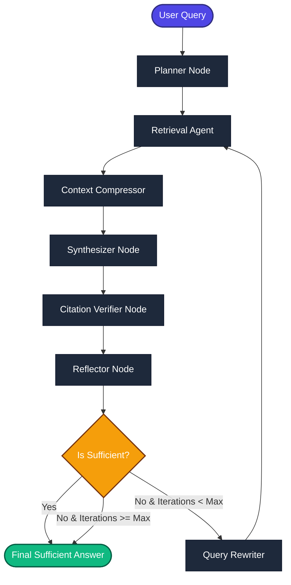

# Scientific Agentic RAG: A Self-Reflecting Multi-Agent System with DeBERTa-v3 NLI Citation Verification

An academic-grade, self-correcting Retrieval-Augmented Generation (RAG) system built with **LangGraph**, designed specifically to ingest, index, and query literature in the Agentic AI domain (2024–2026). The system integrates **Hybrid Sparse-Dense Retrieval**, **Cross-Encoder Reranking**, **NLI-based Citation Verification**, and a **Self-Reflection Loop** with query rewriting.

---

## 🏗️ System Architecture

The pipeline is modeled as a stateful computational graph using **LangGraph**. The workflow enforces factual alignment, prevents hallucination, and iteratively refines query results when the context is insufficient.



### Key Execution Flow
1. **Query Decomposition (Planner)**: Decomposes complex user queries into sub-questions.
2. **Hybrid Retrieval**: Employs Reciprocal Rank Fusion (RRF) combining vector search (BAAI/bge-base-en-v1.5) and lexical search (BM25Okapi).
3. **Reranking**: Scores retrieved chunks using an MS-MARCO Cross-Encoder.
4. **Context Compression (Diversity Promotion)**: Filters chunks to avoid paper-concentration bias (caps max chunks per paper).
5. **Synthesis**: Answers the query citing source arXiv IDs inline (`[arXiv:ID]`).
6. **NLI Verification**: Parses synthesized sentences and checks them against raw document evidence using a `nli-deberta-v3-base` model.
7. **Self-Reflection Loop**: If support ratio is `< 80%` or missing topics are found, the query is rewritten and retrieval is re-executed (up to 3 iterations).

---

## 📂 Project Directory Structure

```directory
├── agents/                       # LangGraph Node Agents
│   ├── planner.py                # Decomposes queries into sub-questions
│   ├── retrieval_agent.py        # Coordinates hybrid retrieval and reranking
│   ├── context_compressor.py     # De-duplicates and enforces source paper diversity
│   ├── synthesizer.py            # Generates evidence-grounded answers
│   ├── citation_verifier.py      # DeBERTa-v3 Natural Language Inference claim verifier
│   ├── reflector.py              # Evaluates answer sufficiency and identifies gaps
│   └── query_rewriter.py         # Refines queries based on missing topics
├── config/                       # System Configurations
│   ├── llm.py                    # LLM client initialization (Llama-3.3-70B via Groq)
│   └── settings.py               # Application-wide setting configurations
├── ingestion/                    # PDF Processing and Embedding Pipeline
│   ├── fetch_arxiv.py            # Queries and fetches paper metadata from arXiv
│   ├── download_papers.py        # Downloads PDFs for the selected arXiv metadata
│   ├── parse_pdfs.py             # Parses PDF text page-by-page using PyMuPDF (fitz)
│   ├── chunk_documents.py        # Chunks extracted text with metadata propagation
│   └── build_vector_store.py     # Embeds text with BGE and indexes into ChromaDB
├── retrieval/                    # Search & Ranking Backend
│   ├── vector_retriever.py       # Dense embedding-based retrieval
│   ├── bm25_retriever.py         # BM25-based lexical retrieval
│   ├── hybrid_retriever.py       # Reciprocal Rank Fusion (RRF) search combiner
│   └── reranker.py               # Cross-Encoder (MS-MARCO) semantic reranker
├── graph/                        # LangGraph Logic
│   ├── state.py                  # TypedDict defining the state schema
│   └── workflow.py               # Compiles nodes and routing logic into research_graph
├── data/                         # Locally stored metadata, PDFs, and vector store
├── add_missing_metadata.py       # Appends metadata for foundational agent papers
├── missing_papers.py             # Utility to query metadata for benchmark papers
├── debug.py                      # Analyzes evaluation dataset paper references
├── evaluate.py                   # Executes and prints evaluations on test questions
├── requirements.txt              # Project package dependencies
└── questions.jsonl               # Test questions dataset (Factoid, Comparative, Survey)
```

---

## 📊 Data Scale & Corpus Statistics

The project processes a high-density academic corpus focused on LLM Agent research. The volume metrics and architectural boundaries are defined below:

* **Source Literature**: **350+ PDF research papers** collected directly from arXiv. These represent a comprehensive corpus covering key papers from 2024 to 2026 (including foundational research on *SWE-agent*, *Mem0*, *OpenHands*, *UI-TARS*, *OSWorld*, *AppWorld*, and *Tau-Bench*).
* **Granular Chunking**: The ingestion pipeline processes raw PDFs into **~45,000 chunks** of text. Configured with a `chunk_size` of `800` and a `chunk_overlap` of `150`, this provides granular, passage-level granularity needed for precise QA, representing approximately **36,000,000 characters** of scientific text.
* **Vector Indexing (ChromaDB Bounds)**: By default, the vector store builder ([build_vector_store.py](file:///c:/Python/Research_intern_project/ingestion/build_vector_store.py#L137-L145)) indexes the **first 5,000 chunks** of the corpus. 
  > [!NOTE]
  > **Why 5,000 Chunks for Development?**
  > 1. **Resource Optimization**: Generating dense embedding vectors (768 dimensions) for 45,000 chunks on standard hardware has non-trivial memory and computation overhead. The 5,000 chunk slice ensures fast build times during local experimentation.
  > 2. **Inference Latency**: Restricts vector search space to keep query latency low during interactive testing.
  > 3. **Scalability**: Scaling to the full 45,000 chunk corpus is as simple as removing the slice limit in `build_vector_store.py` (i.e., changing `chunks = chunks[:5000]` to `chunks = chunks`).

---

## 🛠️ Detailed Component Deep-Dive

### 1. Ingestion Pipeline
* **Metadata Extraction**: `fetch_arxiv.py` queries arXiv for keyword patterns (e.g. `agentic`, `multi-agent`, `computer use`) and keeps papers published from 2024 onwards.
* **PDF Extraction**: `parse_pdfs.py` parses text page-by-page. Pages are marked with `[PAGE_X]` tokens to preserve location references.
* **Semantic Chunking**: `chunk_documents.py` uses `RecursiveCharacterTextSplitter` configured for a chunk size of `800` characters and an overlap of `150` characters. Crucially, metadata like `arxiv_id`, `title`, and `authors` is propagated to every chunk, yielding **~45,000 chunks** from the original **350+ papers**.
* **Vector Indexing**: `build_vector_store.py` Embeds text using the `BAAI/bge-base-en-v1.5` embeddings model and indexes the vectors into a local ChromaDB collection. In development mode, the indexing targets **5,000 chunks** to optimize resource and embedding computation costs.

### 2. Retrieval & Reranking Strategy
The `HybridRetriever` integrates:
* **Dense Retrieval**: `VectorRetriever` runs similarity searches on ChromaDB.
* **Lexical Retrieval**: `BM25Retriever` runs tokenized BM25 search over the text corpus.
* **Reciprocal Rank Fusion (RRF)**: Merges ranks using:
  $$\text{RRF Score}(d) = \sum_{m \in M} \frac{w_m}{k + r_m(d)}$$
  where $r_m(d)$ is the rank of document $d$ in retriever $m$.
* **Title Deduplication**: To prevent retrieval of duplicate chunks from the same paper at this stage, only the highest-scoring chunk per title is initially retained.
* **Cross-Encoder Reranking**: The `Reranker` class utilizes `cross-encoder/ms-marco-MiniLM-L-6-v2` to predict semantic relevance between the query and retrieved documents, selecting the top $K$ chunks (default: 10).

### 3. State Management & Node Logic
The shared graph state is represented by `AgentState` ([graph/state.py](file:///c:/Python/Research_intern_project/graph/state.py)):
```python
class AgentState(TypedDict):
    query: str                          # Original query
    sub_questions: List[str]            # Decomposed sub-questions
    rewritten_query: str                # Latest optimized query
    query_history: List[str]            # List of all queries run
    retrieved_docs: List[Dict[str, Any]]# Documents passed to synthesizer
    answer: str                         # Generated output
    citations: List[Dict[str, Any]]     # References used
    evidence: list                      # Cleaned citations source text
    reflection: str                     # Reflector output dictionary
    iteration_count: int                # Counter to prevent infinite loop
    is_sufficient: bool                 # Exit flag
    retrieval_scores: List[float]       # RRF retrieval scores
    rerank_scores: List[float]          # Cross-encoder rerank scores
    verification_report: dict           # NLI report dict
    compression_stats: dict             # Compressor metrics dict
```

#### 🛡️ NLI Citation Verification Node (`agents/citation_verifier.py`)
This node acts as a truth guard:
1. It splits the generated answer into individual sentences (claims).
2. It pairs each claim against windows from the retrieved documents.
3. It passes these pairs to a **DeBERTa-v3 Natural Language Inference** model (`cross-encoder/nli-deberta-v3-base`).
4. **Classification**:
   * If $\text{score(entailment)} \ge 0.50$ and $\text{score(entailment)} > \text{score(contradiction)}$, the sentence is marked **Supported**.
   * Otherwise, the sentence is marked **Unsupported**.
5. If the overall support ratio (Supported Claims / Total Claims) is less than `80%`, the state is marked as insufficient (`is_sufficient = False`), triggering the query rewriter.

#### 🔄 Self-Reflector Node (`agents/reflector.py`)
The reflector reviews the generated answer based on:
1. **Completeness**: Are all planned sub-questions answered?
2. **Coverage**: Are important concepts missing?
3. **Verification**: Checks the NLI support ratio. If the support ratio is $< 50\%$, it triggers an immediate rewrite loop.
4. **Output**: Returns a JSON structure parsing `is_sufficient`, a `reason`, and list of `missing_topics`.

---

## ⚡ Setup & Run Instructions

### Prerequisites
* Python 3.10+
* GPU with CUDA support is recommended for the cross-encoders (NLI and Reranking), but it runs on CPU as well.

### 1. Environment Configuration
Create a `.env` file in the root directory:
```env
GROQ_API_KEY=your_groq_api_key_here
```

### 2. Dependency Installation
Install the necessary python modules:
```bash
pip install -r requirements.txt
```

### 3. Populate and Ingest the Database
Run the pipeline steps sequentially to construct the vector store:

```bash
# Step 1: Collect paper metadata from arXiv
python ingestion/fetch_arxiv.py

# Step 2: Append manual metadata for key agent papers
python add_missing_metadata.py

# Step 3: Download paper PDFs locally
python ingestion/download_papers.py

# Step 4: Parse PDFs to structured JSON
python ingestion/parse_pdfs.py

# Step 5: Chunk texts and preserve metadata
python ingestion/chunk_documents.py

# Step 6: Compute embeddings and save to ChromaDB
python ingestion/build_vector_store.py
```

### 4. Running Evaluations
You can run the full multi-agent graph against questions in `questions.jsonl`. Open [evaluate.py](file:///c:/Python/Research_intern_project/evaluate.py) to set the `QUESTION_ID` (e.g., `"q01"` to `"q30"`), then run:

```bash
python evaluate.py
```

---

## 📊 Benchmark Dataset (`questions.jsonl`)

The dataset comprises 30 expert-written questions categorized into:
* **Factoid (q01-q10)**: Targets specific facts, names, metrics, and definitions from papers.
* **Comparative (q11-q20)**: Focuses on contrasting architectures, training pipelines, and findings (e.g., contrasting *UI-TARS* and *UI-TARS-2*).
* **Survey (q21-q30)**: Requires synthesis across at least four papers (e.g., summarising agent interoperability protocols like *MCP*, *A2A*, *ACP*, *ANP*).

---

## 🛠️ Tech Stack & Model Details
* **Orchestration**: `langgraph` (v0.2.x+), `langchain`
* **Embedding Model**: `BAAI/bge-base-en-v1.5`
* **Sparse Indexing**: `rank-bm25` (BM25Okapi)
* **Vector Database**: `langchain-chroma` (Chroma DB)
* **Semantic Reranker**: `cross-encoder/ms-marco-MiniLM-L-6-v2` via `sentence-transformers`
* **NLI Claim Verifier**: `cross-encoder/nli-deberta-v3-base`
* **Main LLM**: `llama-3.3-70b-versatile` (via Groq API)
