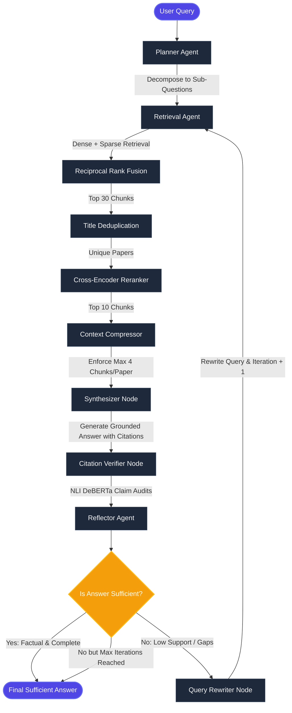

# Technical Report: Factual Self-Reflective Agentic RAG for AI Literature Synthesis

**AIMS DTU Research Internship 2026**
**Project Title**: Agentic Deep Research System over LLM-Agent Papers
**Status**: System Validation & Implementation Stage

---

## 🗺️ System Flowchart & Architecture

The multi-agent system is structured as a stateful graph using **LangGraph** to manage planning, retrieval, synthesis, verification, and query rewriting loops.



---

## Section 1: Project Overview

* **Problem Statement**: Agentic AI literature (2024–2026) is expanding rapidly. Classical LLMs suffer from knowledge cutoff limits and factual hallucinations, making manual literature aggregation inefficient.
* **Goal**: Build an automated agentic research assistant that ingests scientific PDFs, decomposes complex queries, runs hybrid retrieval, generates answers, and audits facts using Natural Language Inference (NLI).
* **Traditional vs. Agentic RAG**:
  ```
  Traditional RAG: User Query ──► Dense Retrieval ──► Synthesize ──► Output (Static)
  
  Agentic RAG:     User Query ──► Planning ──► Hybrid Retrieval ──► Filter ──► Synthesize ──► NLI Verify ──► Reflection ──► Rewrite Loop (Dynamic)
  ```

---

## Section 2: Data Collection & Corpus Ingestion

The corpus consists of **350+ PDF research papers** crawled from arXiv and manually indexed:

```
                  fetch_arxiv.py (Crawl 2024+ Paper Metadata)
                                   │
                                   ▼
                 add_missing_metadata.py (Inject Target Papers)
                                   │
                                   ▼
                download_papers.py (Cache PDF Files Locally)
                                   │
                                   ▼
                  parse_pdfs.py (Extract via PyMuPDF/fitz)
                                   │
                                   ▼
                parsed_papers.json (Structured Document JSON)
```

* **Target Papers**: Includes foundational benchmarks/frameworks such as *SWE-agent*, *Mem0*, *OpenHands*, *UI-TARS*, *OSWorld*, *AppWorld*, and *τ-bench*.
* **Relevance**: Serves as a specialized evaluation base for complex agent capabilities, workflows, and tool integrations.

---

## Section 3: Chunking Strategy

Documents are chunked in [chunk_documents.py](file:///c:/Python/Research_intern_project/ingestion/chunk_documents.py) using `RecursiveCharacterTextSplitter`:

* **Chunk Size**: `800` characters (~120–160 words).
* **Chunk Overlap**: `150` characters.
* **Separators**: `["\n\n", "\n", ". ", " ", ""]` (Priority-ordered).
* **Metadata Embedding**: Every chunk propagates `arxiv_id`, `title`, `authors`, and its location coordinates `[PAGE_X]` to preserve citation traces.
* **Trade-off Analysis**: Smaller chunk size ensures high density of facts and keeps costs within the LLM attention window, while overlap prevents boundary semantic cuts.

---

## Section 4: Retrieval System Design

| Component | Choice | Engineering Rationale (Why?) | Alternatives Considered | Trade-offs |
| :--- | :--- | :--- | :--- | :--- |
| **Vector DB** | **ChromaDB** | File-system persistent, in-memory capability, native metadata filtering. | FAISS, Qdrant, Milvus. | Lacks distributed scale, but avoids network latency. |
| **Embedding** | **BGE-base-en-v1.5** | High MTEB retrieval performance, normalized vectors. | BGE-small, OpenAI text-embed. | Base tier hits a sweet spot between latency and vector quality. |
| **Retrieval** | **Hybrid (Vector + BM25)** | Captures semantic concepts alongside exact terms/arXiv IDs. | Dense-only, Lexical-only. | Increases pipeline construction complexity. |
| **Reranking** | **Cross-Encoder MiniLM** | Computes full query-passage attention scoring. | RRF-only, Cohere Rerank. | Heavy local compute, mitigated by reranking top 30. |

### Reciprocal Rank Fusion (RRF) Formulation
Fused scores are calculated as:
$$\text{Score}_{\text{RRF}}(d) = \frac{1.5}{60 + \text{Rank}_{\text{dense}}(d)} + \frac{1.0}{60 + \text{Rank}_{\text{sparse}}(d)}$$

---

## Section 5: Vector DB Construction (Development Optimization)

During development, the vector store building script [build_vector_store.py](file:///c:/Python/Research_intern_project/ingestion/build_vector_store.py#L137-L145) slices the raw corpus:
```python
# Development mode slice optimization
chunks = chunks[:5000]
```

* **Purpose**: Development-stage optimization to accelerate integration testing and logic verification.
* **Impact**: Reduces embedding generation time from hours to minutes, decreases RAM constraints, and validates search functionality before full scaling.
* **Extensibility**: Scaling to the complete **~45,000 chunk corpus** is done by changing `chunks = chunks[:5000]` to `chunks = chunks`.

---

## Section 6: Agent Workflow & Nodes

1. **Planner Agent** ([planner.py](file:///c:/Python/Research_intern_project/agents/planner.py)): Breaks down complex queries into isolated search goals.
2. **Retrieval Node** ([retrieval_agent.py](file:///c:/Python/Research_intern_project/agents/retrieval_agent.py)): Aggregates hybrid search runs for sub-queries.
3. **Context Compressor** ([context_compressor.py](file:///c:/Python/Research_intern_project/agents/context_compressor.py)): Ensures paper diversity (caps chunks at **4 per paper** and **15 max docs total**) to avoid single-source bias.
4. **Synthesizer Node** ([synthesizer.py](file:///c:/Python/Research_intern_project/agents/synthesizer.py)): Generates a response strictly limited to retrieved evidence, formatting citations like `[arXiv:ID]`.
5. **Citation Verifier** ([citation_verifier.py](file:///c:/Python/Research_intern_project/agents/citation_verifier.py)): Uses **NLI DeBERTa-v3** to check claims:
   $$\text{Claim Verified} \iff \text{Score(Entailment)} \ge 0.50 \quad \text{AND} \quad \text{Score(Entailment)} > \text{Score(Contradiction)}$$
6. **Reflector Agent** ([reflector.py](file:///c:/Python/Research_intern_project/agents/reflector.py)): Evaluates output. If the NLI support ratio is `< 80%` or topics are missing, it triggers the rewriter.
7. **Query Rewriter** ([query_rewriter.py](file:///c:/Python/Research_intern_project/agents/query_rewriter.py)): Refines queries to target missing information, capping cycles at **3 iterations**.

---

## Section 7: Model Selection Specifications

| Model Class | Selected Model | Primary Strength | Primary Limitation | Cost/Compute Profile |
| :--- | :--- | :--- | :--- | :--- |
| **Main LLM** | `llama-3.3-70b-versatile` | High reasoning capacity, 128k context, fast Groq throughput. | Subject to API Rate Limits. | High utility, managed via free-tier API endpoints. |
| **Embeddings** | `bge-base-en-v1.5` | Dense vector quality (768-dim). | Requires local CPU compute. | Extremely lightweight. |
| **Reranker** | `ms-marco-MiniLM-L-6-v2` | High accuracy for MS-MARCO search tasks. | 512 token truncation boundary. | Fast local execution over 30 passages. |
| **NLI Verifier** | `nli-deberta-v3-base` | State-of-the-art entailment classification. | High latency when checking multiple sentences. | Run on GPU/CPU for sentence classification pairs. |

---

## Section 8: Preprocessing & Search Methodology

1. **Extraction**: Query arXiv $\rightarrow$ cache PDFs $\rightarrow$ parse pages via `fitz` with positional indices.
2. **Indexing**: Split text recursively $\rightarrow$ compute dense representations via BGE-base $\rightarrow$ compile index into ChromaDB.
3. **Retrieval**: User query $\rightarrow$ decompose to $S_{1..N}$ $\rightarrow$ execute Hybrid RRF search $\rightarrow$ rerank top 30 down to top 10 using Cross-Encoder.
4. **Agentic Logic**: Build context with a diversity filter $\rightarrow$ generate grounded synthesis $\rightarrow$ audit claims with DeBERTa NLI $\rightarrow$ route through reflection loop if support ratio is $< 80\%$.

---

## Section 9: Implementation Challenges & Mitigations

| Observed Challenge | System Mitigation Strategy |
| :--- | :--- |
| **Rate Limit Violations** | Rate limiting delays are built into arXiv crawler runs; prompts are designed to be concise to minimize LLM interactions. |
| **Source Over-Concentration** | The context compressor limits search inputs to a maximum of 4 chunks per paper to prevent single-source bias. |
| **Hallucinated Statements** | Claims are audited sentence-by-sentence using DeBERTa-v3 Natural Language Inference to verify factual alignment. |
| **Layout Extraction Issues** | PyMuPDF text outputs use boundary tags like `[PAGE_X]` to keep citations linked to their correct page coordinates. |

---

## Section 10: Current Status

* **Status**: In the **System Validation and Embeddings Generation** phase.
* **Evaluation**: The 30-question evaluation set has not yet been executed.
* **Ablations**: Ablation runs are pending database completion.
* **Metrics**: Quantitative benchmarks (accuracy, faithfulness, citation precision/recall, latency) will be reported in a separate file.

---

## Section 11: Future Evaluation Plan

Once compilation is complete, the system will run against the 30 queries in [questions.jsonl](file:///c:/Python/Research_intern_project/questions.jsonl) evaluating:

1. **Accuracy**: Measures alignment with reference answers.
2. **Faithfulness**: The percentage of claims verified as entailed by the NLI verifier.
3. **Citation Precision**: Compares generated citation targets against source texts to confirm evidence matches.
4. **Citation Recall**: Measures if all retrieved relevant facts are correctly cited.
5. **System Latency**: Track time spent per graph node across different iterations.

---

## Section 12: Future Work

* **Full Index compilation**: Expanding the search database to the entire 45,000 chunk corpus.
* **Advanced Rerankers**: Evaluating models like `bge-reranker-large` or Cohere Rerank.
* **State Preservation**: Supporting multi-turn conversation memory for complex queries.
* **Adaptive Planning**: Adjusting sub-questions dynamically during intermediate search cycles.

---

## Section 13: References

1. **ReAct**: Yao, S., et al. (2022). *ReAct: Synergizing Reasoning and Acting in Language Models*. arXiv:2210.03629.
2. **Self-RAG**: Asai, A., et al. (2023). *Self-RAG: Learning to Retrieve, Generate, and Self-Reflect with Retrieval-Augmented Generation*. arXiv:2310.11511.
3. **Reflexion**: Shinn, N., et al. (2023). *Reflexion: Language Agents with Systematic Self-Reflection*. arXiv:2303.11366.
4. **Agentic RAG**: Gao, Y., et al. (2024). *Retrieval-Augmented Generation for Large Language Models: A Survey*. arXiv:2312.10997.
5. **Cross-Encoders**: Reimers, N., & Gurevych, I. (2019). *Sentence-BERT: Sentence Embeddings using Siamese BERT-Networks*. arXiv:1908.10084.

---

## Pending Final Submission Materials

The final evaluation report, ablation study results, prediction files, and quantitative performance analysis will be attached separately through the project drive submission once vector indexing and evaluation on the complete benchmark set have been completed.
